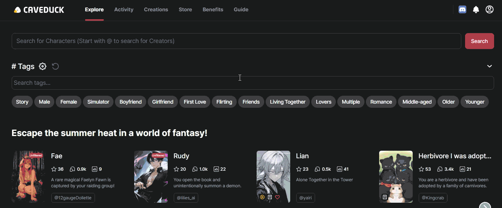

# CaveDuck Tag Searcher

Adds a search bar above the tag list on [caveduck.io](https://caveduck.io), making it easy to filter tags by name.

---

## Features

- Adds a search input to the tag panel
- Filters tags in real-time as you type
- Works in Microsoft Edge and other Chromium browsers
- No personal data collected

---

## How to Install

Since this extension is not published on official extension stores, you can install it manually:

### Microsoft Edge (or any Chromium browser)

1. Download the latest release.
2. Unzip it somewhere.
3. Go to chrome://extensions or edge://extensions.
4. Enable Developer mode.
5. Click Load unpacked.
6. Select the unzipped folder.

Once loaded, visit [caveduck.io](https://caveduck.io) and check the tags panel — a search bar should appear above the tag list!

---

## Folder Structure
caveduck_tag_searcher/  
├── manifest.json  
├── content.js  
├── icons/  
│ ├── icon16.png  
│ ├── icon48.png  
│ ├── icon128.png  

---

## Permissions

This extension only injects a content script on: https://caveduck.io/*

It **does not collect or store any personal data.**

---

## License

MIT License
